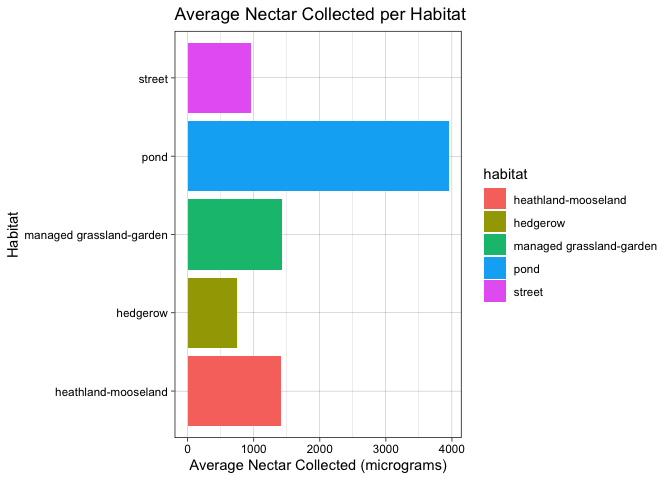

## R Markdown

Uploading the data:


```r
library(tidyverse)
```

```
## ── Attaching packages ─────────────────────────────────────── tidyverse 1.3.0 ──
```

```
## ✓ ggplot2 3.3.3     ✓ purrr   0.3.4
## ✓ tibble  3.0.4     ✓ dplyr   1.0.3
## ✓ tidyr   1.1.2     ✓ stringr 1.4.0
## ✓ readr   1.4.0     ✓ forcats 0.5.0
```

```
## ── Conflicts ────────────────────────────────────────── tidyverse_conflicts() ──
## x dplyr::filter() masks stats::filter()
## x dplyr::lag()    masks stats::lag()
```

```r
library(RColorBrewer)
library(paletteer)
library(janitor)
```

```
## 
## Attaching package: 'janitor'
```

```
## The following objects are masked from 'package:stats':
## 
##     chisq.test, fisher.test
```

```r
library(here)
```

```
## here() starts at /Users/Esha/Desktop/BIS15W2021_Group_6_Project
```

```r
library(skimr)
library(ggthemes)
library(naniar)
```

```
## 
## Attaching package: 'naniar'
```

```
## The following object is masked from 'package:skimr':
## 
##     n_complete
```

```r
library(readr)
library(shiny)
library(shinydashboard)
```

```
## 
## Attaching package: 'shinydashboard'
```

```
## The following object is masked from 'package:graphics':
## 
##     box
```

```r
library(stringr)
library(ggplot2)
```


```r
nectar_perflower <- read_csv(here("potential_datasets", "AgriLand_Nectar_perflower.csv"))
```

```
## 
## ── Column specification ────────────────────────────────────────────────────────
## cols(
##   species = col_character(),
##   location = col_character(),
##   habitat = col_character(),
##   id = col_character(),
##   bagging = col_character(),
##   rinsing = col_character(),
##   bagging.date = col_character(),
##   bagging.hour = col_time(format = ""),
##   collection.date = col_character(),
##   collection.hour = col_time(format = ""),
##   year = col_double(),
##   temp = col_double(),
##   hum = col_double(),
##   plant.no = col_double(),
##   flower.no = col_double(),
##   flower.age = col_character(),
##   flower.sex = col_character(),
##   `sugar in micrograms/flower/24h` = col_double(),
##   `sugarmax in micrograms/flower/24h` = col_double()
## )
```


```r
nectar_perflower <- janitor::clean_names(nectar_perflower)
```


```r
nectar_perflower
```

```
## # A tibble: 3,303 x 19
##    species location habitat id    bagging rinsing bagging_date bagging_hour
##    <chr>   <chr>    <chr>   <chr> <chr>   <chr>   <chr>        <time>      
##  1 Acer p… clifton… grassl… 2012… bag     Y       3/5/12       16:00       
##  2 Acer p… clifton… grassl… 2012… bag     Y       3/5/12       16:00       
##  3 Acer p… clifton… grassl… 2012… bag     Y       3/5/12       16:00       
##  4 Acer p… clifton… grassl… 2012… bag     Y       3/5/12       16:00       
##  5 Acer p… clifton… grassl… 2012… bag     Y       3/5/12       16:00       
##  6 Acer p… clifton… grassl… 2012… bag     Y       3/5/12       16:00       
##  7 Acer p… clifton… grassl… 2012… bag     Y       3/5/12       16:00       
##  8 Acer p… clifton… grassl… 2012… bag     Y       3/5/12       16:00       
##  9 Acer p… clifton… grassl… 2012… bag     Y       3/5/12       16:00       
## 10 Acer p… clifton… grassl… 2012… bag     Y       3/5/12       16:00       
## # … with 3,293 more rows, and 11 more variables: collection_date <chr>,
## #   collection_hour <time>, year <dbl>, temp <dbl>, hum <dbl>, plant_no <dbl>,
## #   flower_no <dbl>, flower_age <chr>, flower_sex <chr>,
## #   sugar_in_micrograms_flower_24h <dbl>,
## #   sugarmax_in_micrograms_flower_24h <dbl>
```


```r
nectar_perflower %>% 
  separate(species,
           into = c("genus", "species")) %>% 
  separate(bagging_date,
           into = c("bagging_day", "bagging_month", "bagging_year"),
           sep = "/")
```

```
## Warning: Expected 2 pieces. Additional pieces discarded in 245 rows [477, 478,
## 479, 480, 481, 482, 483, 484, 485, 486, 487, 488, 489, 490, 491, 492, 493, 494,
## 495, 496, ...].
```

```
## # A tibble: 3,303 x 22
##    genus species location habitat id    bagging rinsing bagging_day
##    <chr> <chr>   <chr>    <chr>   <chr> <chr>   <chr>   <chr>      
##  1 Acer  pseudo… clifton… grassl… 2012… bag     Y       3          
##  2 Acer  pseudo… clifton… grassl… 2012… bag     Y       3          
##  3 Acer  pseudo… clifton… grassl… 2012… bag     Y       3          
##  4 Acer  pseudo… clifton… grassl… 2012… bag     Y       3          
##  5 Acer  pseudo… clifton… grassl… 2012… bag     Y       3          
##  6 Acer  pseudo… clifton… grassl… 2012… bag     Y       3          
##  7 Acer  pseudo… clifton… grassl… 2012… bag     Y       3          
##  8 Acer  pseudo… clifton… grassl… 2012… bag     Y       3          
##  9 Acer  pseudo… clifton… grassl… 2012… bag     Y       3          
## 10 Acer  pseudo… clifton… grassl… 2012… bag     Y       3          
## # … with 3,293 more rows, and 14 more variables: bagging_month <chr>,
## #   bagging_year <chr>, bagging_hour <time>, collection_date <chr>,
## #   collection_hour <time>, year <dbl>, temp <dbl>, hum <dbl>, plant_no <dbl>,
## #   flower_no <dbl>, flower_age <chr>, flower_sex <chr>,
## #   sugar_in_micrograms_flower_24h <dbl>,
## #   sugarmax_in_micrograms_flower_24h <dbl>
```

## Analyses: which habitats have the least and most amount of nectar per flower? How has this changed over the years?

### Exploration of the data: 

Habitats with the most nectar (using sugar_in_micrograms_flower_24h):

```r
nectar_perflower %>%
  group_by(habitat) %>%
  filter(sugar_in_micrograms_flower_24h != "NA") %>%
  summarize(mean_nectar = mean(sugar_in_micrograms_flower_24h)) %>%
  arrange(desc(mean_nectar))
```

```
## # A tibble: 31 x 2
##    habitat                  mean_nectar
##    <chr>                          <dbl>
##  1 pond                           3949.
##  2 managed grassland-garden       1424.
##  3 heathland-mooseland            1410.
##  4 street                          953.
##  5 hedgerow                        744.
##  6 woodland-carpark                605.
##  7 pot                             563.
##  8 wetland                         462.
##  9 cultivated farmland             437.
## 10 woodland                        424.
## # … with 21 more rows
```
Looks like the pond environment has the biggest average of nectar collected per flower. 

Habitats with the least nectar: 

```r
nectar_perflower %>%
  group_by(habitat) %>%
  filter(sugar_in_micrograms_flower_24h != "NA") %>%
  summarize(mean_nectar = mean(sugar_in_micrograms_flower_24h)) %>%
  arrange(mean_nectar)
```

```
## # A tibble: 31 x 2
##    habitat                 mean_nectar
##    <chr>                         <dbl>
##  1 bog                           0    
##  2 rock                          0    
##  3 hedgerow-woodland             0.307
##  4 coastland-grassland           1.41 
##  5 grassland-hedgerow           13.6  
##  6 grassland-carpark            18.7  
##  7 grassland-coastland          28.7  
##  8 allotments                   44.7  
##  9 heathland                    58.9  
## 10 woodland-nature reserve      59.9  
## # … with 21 more rows
```

That's weird that the bog and rock have a mean nectar value of 0.0. Let's take a closer look at them:

```r
nectar_perflower %>%
  filter(habitat == "bog" | habitat == "rock")
```

```
## # A tibble: 17 x 19
##    species location habitat id    bagging rinsing bagging_date bagging_hour
##    <chr>   <chr>    <chr>   <chr> <chr>   <chr>   <chr>        <time>      
##  1 Helian… downs    rock    2011… bag     Y       20/09/2011   15:00       
##  2 Helian… downs    rock    2011… bag     Y       20/09/2011   15:00       
##  3 Helian… downs    rock    2011… bag     Y       20/09/2011   15:00       
##  4 Helian… downs    rock    2011… bag     Y       20/09/2011   15:00       
##  5 Helian… downs    rock    2011… bag     Y       20/09/2011   15:00       
##  6 Helian… downs    rock    2011… bag     Y       20/09/2011   15:00       
##  7 Helian… downs    rock    2011… bag     Y       20/09/2011   15:00       
##  8 Narthe… cleddon… bog     2012… bag     Y       29/08/2012   12:00       
##  9 Narthe… cleddon… bog     2012… bag     Y       29/08/2012   12:00       
## 10 Narthe… cleddon… bog     2012… bag     Y       29/08/2012   12:00       
## 11 Narthe… cleddon… bog     2012… bag     Y       29/08/2012   12:00       
## 12 Narthe… cleddon… bog     2012… bag     Y       29/08/2012   12:00       
## 13 Narthe… cleddon… bog     2012… bag     Y       29/08/2012   12:00       
## 14 Narthe… cleddon… bog     2012… bag     Y       29/08/2012   12:00       
## 15 Narthe… cleddon… bog     2012… bag     Y       29/08/2012   12:00       
## 16 Narthe… cleddon… bog     2012… bag     Y       29/08/2012   12:00       
## 17 Narthe… cleddon… bog     2012… bag     Y       29/08/2012   12:00       
## # … with 11 more variables: collection_date <chr>, collection_hour <time>,
## #   year <dbl>, temp <dbl>, hum <dbl>, plant_no <dbl>, flower_no <dbl>,
## #   flower_age <chr>, flower_sex <chr>, sugar_in_micrograms_flower_24h <dbl>,
## #   sugarmax_in_micrograms_flower_24h <dbl>
```
This chart indicates to us that the average amount of nectar collected for the bog and habitat environments is actually zero. Interesting. Though it makes sense logically that the researchers didn't collect any nectar from the "rock" habitat, I'm curious as to how or why they weren't able to find any in a bog (aka a wetland!) since bogs actually are home to a variety of flowers. 

Plotting the habitats with the most nectar (I plotted this to accompany the chart I just made, since a visual will be better for people to look at in a powerpoint presentation): 

```r
nectar_perflower %>%
  group_by(habitat) %>%
  filter(sugar_in_micrograms_flower_24h != "NA") %>%
  summarize(mean_nectar = mean(sugar_in_micrograms_flower_24h)) %>%
  arrange(desc(mean_nectar)) %>%
  top_n(5) %>%
  ggplot(aes(x = habitat, y = mean_nectar, fill = habitat)) + 
  geom_col() + 
  labs(title = "Average Nectar Collected per Habitat", x = "Habitat", y = "Average Nectar Collected (micrograms)") +
  coord_flip() + 
  theme_linedraw()
```

```
## Selecting by mean_nectar
```

<!-- -->

Habitats with the most nectar (using sugarmax_in_micrograms_flower_24h instead to see if there are significant differences):

```r
nectar_perflower %>%
  group_by(habitat) %>%
  filter(sugarmax_in_micrograms_flower_24h != "NA") %>%
  summarize(mean_nectar_from_max = mean(sugarmax_in_micrograms_flower_24h)) %>%
  arrange(desc(mean_nectar_from_max))
```

```
## # A tibble: 31 x 2
##    habitat                  mean_nectar_from_max
##    <chr>                                   <dbl>
##  1 pond                                    3949.
##  2 managed grassland-garden                1424.
##  3 heathland-mooseland                     1410.
##  4 street                                   962.
##  5 hedgerow                                 752.
##  6 woodland-carpark                         629.
##  7 pot                                      564.
##  8 wetland                                  464.
##  9 cultivated farmland                      437.
## 10 woodland                                 426.
## # … with 21 more rows
```
Looks like we get the same results as we got when we analyzed the sugar_in_micrograms_flower_24h. I wonder now what the difference between the "sugarmax_in_micrograms_flower_24h" variable and the sugar_in_micrograms_flower_24h is. Why were these variables made seperate if they show the same results?


```r
nectar_perflower %>%
  group_by(habitat) %>%
  filter(sugarmax_in_micrograms_flower_24h != "NA") %>%
  summarize(mean_nectar_from_max = mean(sugarmax_in_micrograms_flower_24h)) %>%
  arrange(mean_nectar_from_max)
```

```
## # A tibble: 31 x 2
##    habitat                 mean_nectar_from_max
##    <chr>                                  <dbl>
##  1 bog                                    0    
##  2 rock                                   0    
##  3 hedgerow-woodland                      0.750
##  4 coastland-grassland                    4.68 
##  5 grassland-carpark                     22.9  
##  6 grassland-coastland                   31.3  
##  7 grassland-hedgerow                    45.2  
##  8 allotments                            50.0  
##  9 woodland-nature reserve               65.4  
## 10 grassland-wetland                     80.8  
## # … with 21 more rows
```
We also got the same results as before when we arranged mean_nectar_from_max from the smallest mean to the larger mean. 

Plotting the habitats with the most nectar (using sugarmax instead): 

```r
nectar_perflower %>%
  group_by(habitat) %>%
  filter(sugarmax_in_micrograms_flower_24h != "NA") %>%
  summarize(mean_nectar_from_max = mean(sugarmax_in_micrograms_flower_24h)) %>%
  arrange(desc(mean_nectar_from_max)) %>%
  top_n(5) %>%
  ggplot(aes(x = habitat, y = mean_nectar_from_max, fill = habitat)) + 
  geom_col() + 
  coord_flip() +
  theme_linedraw()
```

```
## Selecting by mean_nectar_from_max
```

<!-- -->

I made this plot to try and see if we could represent how the average nectar collected changed over 2011-2012 (the years that the study was conducted): 

```r
nectar_perflower %>%
  group_by(habitat, year) %>%
  filter(sugarmax_in_micrograms_flower_24h != "NA") %>%
  ggplot(aes(x = year, y = sugar_in_micrograms_flower_24h, color = habitat)) + 
  geom_point() +
  theme_linedraw()
```

```
## Warning: Removed 4 rows containing missing values (geom_point).
```

<!-- -->

This is clearly not the best way to show how the mean nectar collected changes over time. Let's try a different kind of plot: 

```r
nectar_perflower %>%
  group_by(habitat, year) %>%
  filter(sugar_in_micrograms_flower_24h != "NA") %>%
  filter(habitat == "street" | habitat == "pond" | habitat == "managed grassland-garden" | habitat == "hedgerow" | habitat == "healthland-mooseland") %>%
  summarize(mean_nectar = mean(sugar_in_micrograms_flower_24h)) %>%
  ggplot(aes(x = habitat, y = mean_nectar, fill = habitat)) + 
  geom_col() + 
  coord_flip() +
  facet_wrap(~year) +  labs(x = "Habitat", y = "Nectar Collected (micrograms)") +
  theme_linedraw()
```

```
## `summarise()` has grouped output by 'habitat'. You can override using the `.groups` argument.
```

<!-- -->
This is a very problematic aspect of this data. Unfortunately, it looks as if the researchers didn't stay consistent and revisit some of the habitats they visited in 2011/didn't visit some of the places they went to in 2012 back in 2011. 

I performed the following analyses to figure out if there are any habitats which the scientists collected nectar from in 2011 and 2012: 

```r
nectar_perflower %>%
  group_by(habitat) %>%
  filter(sugar_in_micrograms_flower_24h != "NA") %>%
  filter(year == "2011")
```

```
## # A tibble: 1,759 x 19
## # Groups:   habitat [10]
##    species location habitat id    bagging rinsing bagging_date bagging_hour
##    <chr>   <chr>    <chr>   <chr> <chr>   <chr>   <chr>        <time>      
##  1 Achill… brandon… grassl… 2011… bag     Y       27/07/2011   11:30       
##  2 Achill… brandon… grassl… 2011… bag     Y       27/07/2011   11:30       
##  3 Achill… brandon… grassl… 2011… bag     Y       27/07/2011   11:30       
##  4 Achill… brandon… grassl… 2011… bag     Y       27/07/2011   11:30       
##  5 Achill… brandon… grassl… 2011… bag     Y       27/07/2011   11:30       
##  6 Achill… brandon… grassl… 2011… bag     Y       27/07/2011   11:30       
##  7 Achill… brandon… grassl… 2011… bag     Y       27/07/2011   11:30       
##  8 Achill… brandon… grassl… 2011… bag     Y       27/07/2011   11:30       
##  9 Achill… brandon… grassl… 2011… bag     Y       27/07/2011   11:30       
## 10 Achill… brandon… grassl… 2011… bag     Y       27/07/2011   11:30       
## # … with 1,749 more rows, and 11 more variables: collection_date <chr>,
## #   collection_hour <time>, year <dbl>, temp <dbl>, hum <dbl>, plant_no <dbl>,
## #   flower_no <dbl>, flower_age <chr>, flower_sex <chr>,
## #   sugar_in_micrograms_flower_24h <dbl>,
## #   sugarmax_in_micrograms_flower_24h <dbl>
```


```r
nectar_perflower %>%
  group_by(habitat) %>%
  filter(sugar_in_micrograms_flower_24h != "NA") %>%
  filter(year == "2012")
```

```
## # A tibble: 1,469 x 19
## # Groups:   habitat [23]
##    species location habitat id    bagging rinsing bagging_date bagging_hour
##    <chr>   <chr>    <chr>   <chr> <chr>   <chr>   <chr>        <time>      
##  1 Acer p… clifton… grassl… 2012… bag     Y       3/5/12       16:00       
##  2 Acer p… clifton… grassl… 2012… bag     Y       3/5/12       16:00       
##  3 Acer p… clifton… grassl… 2012… bag     Y       3/5/12       16:00       
##  4 Acer p… clifton… grassl… 2012… bag     Y       3/5/12       16:00       
##  5 Acer p… clifton… grassl… 2012… bag     Y       3/5/12       16:00       
##  6 Acer p… clifton… grassl… 2012… bag     Y       3/5/12       16:00       
##  7 Acer p… clifton… grassl… 2012… bag     Y       3/5/12       16:00       
##  8 Acer p… clifton… grassl… 2012… bag     Y       3/5/12       16:00       
##  9 Acer p… river f… wetland 2012… bag     N       15/04/2012   16:00       
## 10 Acer p… river f… wetland 2012… bag     N       15/04/2012   16:00       
## # … with 1,459 more rows, and 11 more variables: collection_date <chr>,
## #   collection_hour <time>, year <dbl>, temp <dbl>, hum <dbl>, plant_no <dbl>,
## #   flower_no <dbl>, flower_age <chr>, flower_sex <chr>,
## #   sugar_in_micrograms_flower_24h <dbl>,
## #   sugarmax_in_micrograms_flower_24h <dbl>
```
Looks like the only habitat that the scientists visited in 2011 and 2012 was the wetland. That is unfortunate. But we'll do what we can and see how the nectar collected has changed over the years (or in the case of this data, year). 

I'm making this graph to compare how the average nectar collected changed over 2011-2012:

```r
wetland_by_species <- nectar_perflower %>%
  filter(habitat == "wetland") %>%
  filter(sugar_in_micrograms_flower_24h != "NA") %>%
  ggplot(aes(x = species, y = sugar_in_micrograms_flower_24h, fill = species), legend = "NULL") + 
  geom_boxplot() + 
  coord_flip() +
  facet_wrap(~year) + 
  theme_linedraw()

wetland_by_species
```

<!-- -->


```r
wetland_by_species+theme_linedraw()+
  theme(legend.position = "none",
        axis.text.x = element_text(angle = 60, hjust=1))+
  labs(title = "Nectar Collected from the Wetland Habitat by Species (2011-2012)",
       x = "Nectar Collected (micrograms) ",
       y= "Species")
```

<!-- -->
This graph shows how the species collected in the wetland habitat varied over the years. I made another graph to summarize how many species were collected from 2011-2012: 


```r
nectar_perflower %>%
  filter(habitat == "wetland") %>%
  filter(sugar_in_micrograms_flower_24h != "NA") %>%
  ggplot(aes(x = habitat, y = sugar_in_micrograms_flower_24h, fill = species)) + 
  geom_col() + 
  facet_wrap(~year) +
  theme_linedraw() + 
  labs(title = "Nectar Collected from the Wetland Habitat by Species (2011-2012)",
       x = "Habitat",
       y = "Nectar Collected (micrograms)")
```

<!-- -->
This graph gives us a better idea of how much the nectar that we collected changed over the years. 

### App for Data Organization

I made this app to actually help the researchers keep track of their data and for anyone like us to wants to analyze it. The app displays the amount of nectar collected per species in each habitat, and it allows you to select which habitat and year to focus on. This way, the researchers can keep track of where they are missing data (in other words, they can keep track of which years they neglected to visit certain habitats) and allows people analyzing the data to not jumpt to any incorrect conclusions (for example, it would be incorrect to assume that the average mean nectar collected from a certain habitat increased from 2011-2012 when the researchers didn't actually collect any data in 2011 for that habitat).

Side note: the final, working version of my app is labeled as "esha's_app_final". Please do not look at the one labeled "esha's_app", that was a version that is broken. 

Here's the app:

```r
ui <- dashboardPage(skin = "black",
                    dashboardHeader(title = "Change in Nectar Quantities Collected in the UK (2011-2012)",
                                    titleWidth = 600),
                    dashboardSidebar(disable = T),
                    dashboardBody(
                      fluidRow(
                        box(title = "Plot Options", width = 3,
                            selectInput("x", "Select a Habitat:", choices = c("allotments", "bog", "cemetery-park", "coastland-grassland", "cultivated farmland", "dwarf shrub heath", "garden", "grassland", "grassland-carpark", "grassland-coastland", "grassland-coastland", "grassland-hedgerow", "grassland-nature reserve", "grassland-park", "grassland-wetland", "grassland-woodland", "heathland", "heathland-mooseland", "hedgerow", "hedgerow-woodland", "managed grassland-park", "moorland", "pavement", "pond", "pot", "rock", "street", "wetland", "woodland", "woodland-carpark", "woodland-nature reserve"), 
                                        selected = "wetland"),
                            selectInput("y", "Select a Year:", choices = c("2011", "2012"),
                                        selected = "2011"),
                            sliderInput("pointsize", "Select the Point Size", min = 1, max = 5, value = 2, step = 0.5),
                            hr(),
                            helpText("Reference: Baude M, Kunin W, Boatman N, Davies N, Gillespie M, Morton D, Smart S, Memmott J. 
               Historical nectar assessment reveals the fall and rise of floral resources in Britain. 2016.")
                        ), # close the first box
                        box(title = "Nectar Collection by Habitat", width = 6,
                            plotOutput("plot", width = "600px", height = "500px")
                        ) # close the second box
                      ) # close the row
                    ) # close the dashboard body
) # close the ui

server <- function(input, output, session) { 
  
  output$plot <- renderPlot({
    nectar_perflower %>%
      filter(habitat==input$x & year ==input$y) %>% 
      ggplot(aes_string(x = "species", y = "sugar_in_micrograms_flower_24h", fill = "species")) +
      geom_point(size=input$pointsize, alpha=0.8) +
      geom_col()+
      theme(axis.text.x = element_text(angle = 60, hjust = 1)) +
      labs(y = "Nectar Collected (micrograms)",
           x = "Species")
  })
  
  # stop the app when we close it
  session$onSessionEnded(stopApp)
}

shinyApp(ui, server)
```

`<div style="width: 100% ; height: 400px ; text-align: center; box-sizing: border-box; -moz-box-sizing: border-box; -webkit-box-sizing: border-box;" class="muted well">Shiny applications not supported in static R Markdown documents</div>`{=html}

## Concluding Remarks
Through our investigation of how the total amount of nectar collected varies per habitat, we see that there is clear variance in in mean nectar per habitat. The habitat from which the most nectar was collected was the pond habitat. The habitat from which the least nectar was collected were the bog and the rock. In our analysis, we think that the high biodiversity in the pond habitat may have contributed to increased nectar production/collection. The rock habitat may not have been home to many flowering plants, explaining that aspect of the data. On closer investigation, the bog likely had a low nectar production because the researchers visited this habitat during the Autumn season (which isn't ideal!). 

This data contained another major discrepancy: the researchers didn't consistently visit each habitat for both 2011 and 2012. Due to that, we were only able to look at the wetland habitat (which did have data for 2011 and 2012) to determine how nectar collection changed over the years. Overall, we determined that the overall nectar collected actually decreased over the years. It is entirely possible that this decrease could be explained by a pollinator decline, but it is possible that this too could be the result of the researchers failing to be consistent (some of the plants that nectar was collected from were not revisited in 2011, for some reason). 
