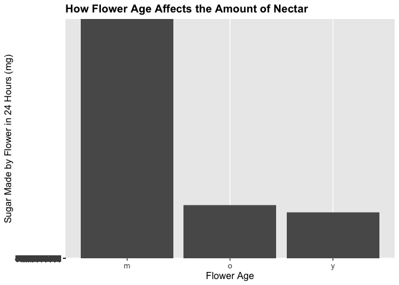

```r
library(tidyverse)
```

```
## ── Attaching packages ─────────────────────────────────────── tidyverse 1.3.0 ──
```

```
## ✓ ggplot2 3.3.3     ✓ purrr   0.3.4
## ✓ tibble  3.1.0     ✓ dplyr   1.0.4
## ✓ tidyr   1.1.3     ✓ stringr 1.4.0
## ✓ readr   1.4.0     ✓ forcats 0.5.1
```

```
## ── Conflicts ────────────────────────────────────────── tidyverse_conflicts() ──
## x dplyr::filter() masks stats::filter()
## x dplyr::lag()    masks stats::lag()
```

```r
library(RColorBrewer)
library(paletteer)
library(janitor)
```

```
## 
## Attaching package: 'janitor'
```

```
## The following objects are masked from 'package:stats':
## 
##     chisq.test, fisher.test
```

```r
library(here)
```

```
## here() starts at /Users/alvarezlean/Desktop/BIS15L Project/BIS15W2021_Group_6_Project/BIS15W2021_Group_6_Project
```

```r
library(skimr)
library(ggthemes)
library(naniar)
```

```
## 
## Attaching package: 'naniar'
```

```
## The following object is masked from 'package:skimr':
## 
##     n_complete
```

```r
library(readr)
options(scipen=999)
library(shiny)
library(shinydashboard)
```

```
## 
## Attaching package: 'shinydashboard'
```

```
## The following object is masked from 'package:graphics':
## 
##     box
```

```r
if (!require("tidyverse")) install.packages('tidyverse')
```

This is a preloading of the data. The original publication can be found [here](https://doi.org/10.1038/nature16532) and it was also mentioned in [this paper.](https://doi.org/10.1111/2041-210X.12779).

```r
nectar_per_flower <- read_csv(here("potential_datasets", "AgriLand_Nectar_perflower.csv"))
```

```
## 
## ── Column specification ────────────────────────────────────────────────────────
## cols(
##   species = col_character(),
##   location = col_character(),
##   habitat = col_character(),
##   id = col_character(),
##   bagging = col_character(),
##   rinsing = col_character(),
##   bagging.date = col_character(),
##   bagging.hour = col_time(format = ""),
##   collection.date = col_character(),
##   collection.hour = col_time(format = ""),
##   year = col_double(),
##   temp = col_double(),
##   hum = col_double(),
##   plant.no = col_double(),
##   flower.no = col_double(),
##   flower.age = col_character(),
##   flower.sex = col_character(),
##   `sugar in micrograms/flower/24h` = col_double(),
##   `sugarmax in micrograms/flower/24h` = col_double()
## )
```


```r
nectar_per_flower <- janitor::clean_names(nectar_per_flower)
nectar_per_flower
```

```
## # A tibble: 3,303 x 19
##    species  location  habitat id       bagging rinsing bagging_date bagging_hour
##    <chr>    <chr>     <chr>   <chr>    <chr>   <chr>   <chr>        <time>      
##  1 Acer ps… clifton-… grassl… 2012-Ac… bag     Y       3/5/12       16:00       
##  2 Acer ps… clifton-… grassl… 2012-Ac… bag     Y       3/5/12       16:00       
##  3 Acer ps… clifton-… grassl… 2012-Ac… bag     Y       3/5/12       16:00       
##  4 Acer ps… clifton-… grassl… 2012-Ac… bag     Y       3/5/12       16:00       
##  5 Acer ps… clifton-… grassl… 2012-Ac… bag     Y       3/5/12       16:00       
##  6 Acer ps… clifton-… grassl… 2012-Ac… bag     Y       3/5/12       16:00       
##  7 Acer ps… clifton-… grassl… 2012-Ac… bag     Y       3/5/12       16:00       
##  8 Acer ps… clifton-… grassl… 2012-Ac… bag     Y       3/5/12       16:00       
##  9 Acer ps… clifton-… grassl… 2012-Ac… bag     Y       3/5/12       16:00       
## 10 Acer ps… clifton-… grassl… 2012-Ac… bag     Y       3/5/12       16:00       
## # … with 3,293 more rows, and 11 more variables: collection_date <chr>,
## #   collection_hour <time>, year <dbl>, temp <dbl>, hum <dbl>, plant_no <dbl>,
## #   flower_no <dbl>, flower_age <chr>, flower_sex <chr>,
## #   sugar_in_micrograms_flower_24h <dbl>,
## #   sugarmax_in_micrograms_flower_24h <dbl>
```


```r
nectar_per_flower %>% 
  group_by(flower_no) %>% 
  summarise(total_flower_number=sum(flower_no))
```

```
## # A tibble: 43 x 2
##    flower_no total_flower_number
##  *     <dbl>               <dbl>
##  1         1                 175
##  2         2                 350
##  3         3                 525
##  4         4                 696
##  5         5                 870
##  6         6                1032
##  7         7                1183
##  8         8                1312
##  9         9                1440
## 10        10                1580
## # … with 33 more rows
```


```r
nectar_per_flower <- nectar_per_flower %>% 
  separate(species,
           into = c("genus", "epithet")) %>% 
  separate(bagging_date,
           into = c("bagging_day", "bagging_month", "bagging_year"),
           sep = "/")
```

```
## Warning: Expected 2 pieces. Additional pieces discarded in 245 rows [477, 478,
## 479, 480, 481, 482, 483, 484, 485, 486, 487, 488, 489, 490, 491, 492, 493, 494,
## 495, 496, ...].
```


# Lean's analyses
How do time of day, flower age, and flower sex affect the amount of nectar per flower?


#### Note: NA's are removed

```r
nectar_per_flower %>% 
  filter(flower_age!="NA", sugar_in_micrograms_flower_24h!="NA") %>% 
  ggplot(aes(x=flower_age, y=sugar_in_micrograms_flower_24h))+
  geom_col()+
  labs(title = "How Flower Age Affects the Amount of Nectar", x = "Flower Age", y = "Sugar Made by Flower in 24 Hours (mg)") +
  theme(legend.position = "bottom",
        plot.title = element_text(size = 14, face = "bold"),
        axis.text = element_text(size = 10),
        axis.title = element_text(size = 12))
```

<!-- -->

Flowers that are not too young or not too old produce the most nectar. 


```r
nectar_per_flower %>% 
  filter(flower_sex!="NA", sugar_in_micrograms_flower_24h!="NA") %>% 
  group_by(flower_sex) %>% 
  ggplot(aes(x=flower_sex, y=sugar_in_micrograms_flower_24h))+
  geom_col()+
  labs(title = "How Flower Sex Affects the Amount of Nectar", x = "Flower Sex", y = "Sugar Collected by Flower in 24 Hours (mg)") +
  theme(legend.position = "bottom",
        plot.title = element_text(size = 14, face = "bold"),
        axis.text = element_text(size = 10),
        axis.title = element_text(size = 12))
```

<!-- -->

Flowers that are hermaphrodite (have both male and female sex organs) produce the most nectar. 


```r
nectar_per_flower %>% 
  filter(collection_hour!="NA", sugar_in_micrograms_flower_24h!="NA") %>% 
  ggplot(aes(x=collection_hour, y=sugar_in_micrograms_flower_24h))+
  geom_col()+
  labs(title = "What Time Gives the Most Amount of Nectar?", x = "Collection Hour", y = "Sugar Collected by Flower in 24 Hours (mg)") +
  theme(legend.position = "bottom",
        plot.title = element_text(size = 14, face = "bold"),
        axis.text = element_text(size = 10),
        axis.title = element_text(size = 12))
```

<!-- -->

Flowers collected from about 10:00 AM to 2:00 PM produce the most nectar. Perhaps this is because it is generally quite sunny around this time. Therefore, pollinators likely come to the flowers most at around this time. 


```r
nectar_per_flower$sugar_in_micrograms_flower_24h <- as.numeric(nectar_per_flower$sugar_in_micrograms_flower_24h)
nectar_per_flower$year <- as.numeric(nectar_per_flower$year)
```


```r
ui <- fluidPage(    
  
  titlePanel("Amount of Nectar Produced Per Habitat"),
  sidebarLayout(      
    sidebarPanel(
      selectInput("habitat", " Select Habitat of Interest:", 
                  choices=unique(nectar_per_flower$habitat)),
      hr(),
      helpText("Reference: Baude M, Kunin W, Boatman N, Davies N, Gillespie M, Morton D, Smart S, Memmott J. Historical nectar assessment reveals the fall and rise of floral resources in Britain. 2016.")
    ),
    
    mainPanel(
      plotOutput("habitatPlot")  
    )
    
  )
)

server <- function(input, output, session) {
  
  output$habitatPlot <- renderPlot({
    nectar_per_flower %>% 
    filter(habitat == input$habitat) %>% 
    filter(sugar_in_micrograms_flower_24h!="NA", habitat!="NA") %>%
    ggplot(aes(x=sugar_in_micrograms_flower_24h)) + 
    geom_density(color="black", fill="pink", alpha=0.8)+
    theme_light(base_size = 19) +
    labs(y = "Nectar Produced (mg)")
  })
  
}

shinyApp(ui, server)
```

`<div style="width: 100% ; height: 400px ; text-align: center; box-sizing: border-box; -moz-box-sizing: border-box; -webkit-box-sizing: border-box;" class="muted well">Shiny applications not supported in static R Markdown documents</div>`{=html}


```r
ui <- dashboardPage(skin="black",
  dashboardHeader(title = "Why are Insect Pollinator Communities Declining?",
                  titleWidth = 450),
  dashboardSidebar(disable = T),
  dashboardBody(
  fluidRow(
  box(title = "Variable Options", width = 3,
  selectInput("x", "Select Variable:", choices = c("collection_date", "year", "temp", "hum", "flower_sex", "flower_age", "collection_hour"),
              selected = "collection_date"),
  hr(),
      helpText("Reference: Baude M, Kunin W, Boatman N, Davies N, Gillespie M, Morton D, Smart S, Memmott J. Historical nectar assessment reveals the fall and rise of floral resources in Britain. 2016.")
  ), 
  box(title = "Amount of Nectar Produced", width = 6,
  plotOutput("plot", width = "600px", height = "500px")
  ) 
  ) 
  ) 
)

server <- function(input, output, session) { 
  
  output$plot <- renderPlot({
  nectar_per_flower %>%
    filter(flower_sex!="NA", flower_age!="NA", sugar_in_micrograms_flower_24h!="NA", collection_date!="NA", year!="NA", temp!="NA", hum!="NA", collection_hour!="NA") %>%
    ggplot(aes_string(x=input$x)) + 
    geom_bar(position="dodge", color="black", fill="pink", alpha=0.8) +
    theme_light(base_size = 19) +
    labs(y = "Nectar Produced (mg)")
  })
  
  session$onSessionEnded(stopApp)
  }

shinyApp(ui, server)
```

`<div style="width: 100% ; height: 400px ; text-align: center; box-sizing: border-box; -moz-box-sizing: border-box; -webkit-box-sizing: border-box;" class="muted well">Shiny applications not supported in static R Markdown documents</div>`{=html}


"There is considerable concern over declines in insect pollinator communities and potential impacts on the pollination of crops and wildflowers."

### Main Question:
-Why are insect pollinator communities declining?

### Possible Analyses
1. Which habitats have the least and most amount of nectar per flower? Why?
2. Which months have the least and most amount of nectar per flower? Why?
2. How do temperature and humidity affect the amount of nectar per flower?
3. How do age, sex, and collection hour affect the amount of nectar per flower?
4. Why is there a discrepancy between sugar and sugar max?

-Which combinations of factors result in the least and most amount of nectar per flower? 
  (amount of nectar is correlated to amount of pollinators bc flowers use nectar to attract pollinators)
  
-what factors possibly contribute to the decline of pollinators?

-what steps can we take to minimize the loss of pollinator communities?


#### changes
-add hypotheses
-change each x axis numbers manually?
