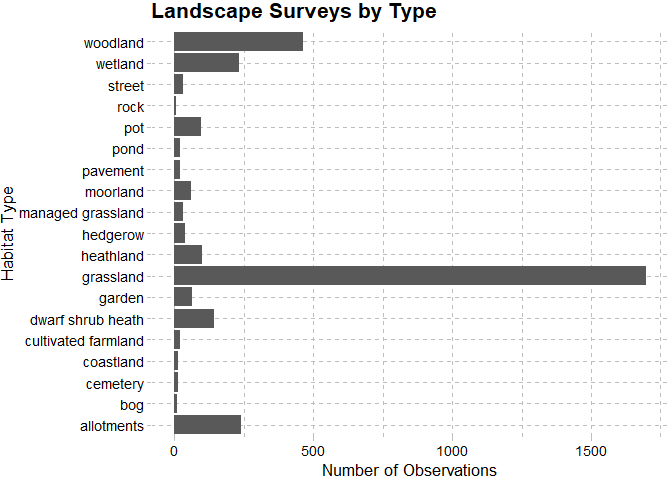
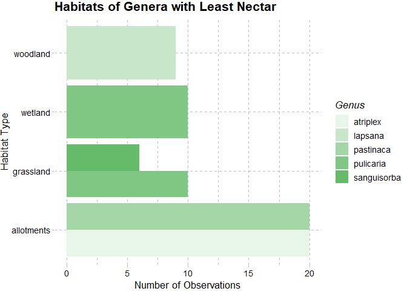
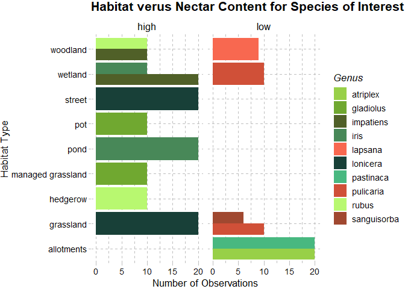

### Suggested Analysis (via Lean):
1. Genus and species present in each habitat
2. Which habitats have the least and most amount of nectar per flower
3. How temperature and humidity affect the amount of nectar per flower
4. How flower #, age, and sex affect the amount of nectar per flower

### Big Picture Questions (via Lean):
1. Which combinations of factors result in the least and most amount of nectar per flower? 
  (Amount of nectar is correlated to amount of pollinators --> flowers use nectar to attract pollinators)
2. Why are insect pollinator communities declining?


## Loading Libraries

```r
library(tidyverse)
```

```
## -- Attaching packages --------------------------------------- tidyverse 1.3.0 --
```

```
## v ggplot2 3.3.3     v purrr   0.3.4
## v tibble  3.0.6     v dplyr   1.0.4
## v tidyr   1.1.2     v stringr 1.4.0
## v readr   1.4.0     v forcats 0.5.1
```

```
## -- Conflicts ------------------------------------------ tidyverse_conflicts() --
## x dplyr::filter() masks stats::filter()
## x dplyr::lag()    masks stats::lag()
```

```r
library(RColorBrewer)
library(paletteer)
library(janitor)
```

```
## 
## Attaching package: 'janitor'
```

```
## The following objects are masked from 'package:stats':
## 
##     chisq.test, fisher.test
```

```r
library(here)
```

```
## here() starts at C:/Users/adria/Desktop/BIS15W2021_Group_6_Project
```

```r
library(skimr)
library(ggthemes)
library(naniar)
```

```
## 
## Attaching package: 'naniar'
```

```
## The following object is masked from 'package:skimr':
## 
##     n_complete
```

```r
library(readr)
library(shiny)
library(shinydashboard)
```

```
## 
## Attaching package: 'shinydashboard'
```

```
## The following object is masked from 'package:graphics':
## 
##     box
```

## Removing scientific notation

```r
options(scipen=999) #cancels scientific notation for the session, not permanently
```

Color Palette Workshop

```r
colors <- paletteer::palettes_d_names
#view(colors)
```


## Loading data
This is a preloading of the data. The original publication can be found [here](https://doi.org/10.1038/nature16532) and it was also mentioned in [this paper.](https://doi.org/10.1111/2041-210X.12779).

```r
nectar_perflower <- read_csv(here("potential_datasets", "AgriLand_Nectar_perflower_families.csv"))
```

```
## 
## -- Column specification --------------------------------------------------------
## cols(
##   .default = col_character(),
##   bagging.hour = col_time(format = ""),
##   collection.hour = col_time(format = ""),
##   year = col_double(),
##   temp = col_double(),
##   hum = col_double(),
##   plant.no = col_double(),
##   flower.no = col_double(),
##   `sugar in micrograms/flower/24h` = col_double(),
##   `sugarmax in micrograms/flower/24h` = col_double()
## )
## i Use `spec()` for the full column specifications.
```

### Nectar Per Flower Analysis


```r
nectar_perflower_clean <- nectar_perflower %>% 
  clean_names() %>% 
  mutate_all(tolower)
summary(nectar_perflower_clean)
```

```
##     family            species            location           habitat         
##  Length:3303        Length:3303        Length:3303        Length:3303       
##  Class :character   Class :character   Class :character   Class :character  
##  Mode  :character   Mode  :character   Mode  :character   Mode  :character  
##       id              bagging            rinsing          bagging_date      
##  Length:3303        Length:3303        Length:3303        Length:3303       
##  Class :character   Class :character   Class :character   Class :character  
##  Mode  :character   Mode  :character   Mode  :character   Mode  :character  
##  bagging_hour       collection_date    collection_hour        year          
##  Length:3303        Length:3303        Length:3303        Length:3303       
##  Class :character   Class :character   Class :character   Class :character  
##  Mode  :character   Mode  :character   Mode  :character   Mode  :character  
##      temp               hum              plant_no          flower_no        
##  Length:3303        Length:3303        Length:3303        Length:3303       
##  Class :character   Class :character   Class :character   Class :character  
##  Mode  :character   Mode  :character   Mode  :character   Mode  :character  
##   flower_age         flower_sex        sugar_in_micrograms_flower_24h
##  Length:3303        Length:3303        Length:3303                   
##  Class :character   Class :character   Class :character              
##  Mode  :character   Mode  :character   Mode  :character              
##  sugarmax_in_micrograms_flower_24h
##  Length:3303                      
##  Class :character                 
##  Mode  :character
```


```r
nectar_perflower_clean <- nectar_perflower_clean %>% 
  separate(species,
           into = c("genus", "species")) %>% 
  separate(bagging_date,
           into = c("bagging_day", "bagging_month", "bagging_year"),
           sep = "/") %>% 
  separate(collection_date,
           into = c("collection_day", "collection_month", "collection_year"),
           sep = "/") %>% 
  separate(habitat,
           into = c("habitat_class", "habitat_specific"),
                    sep = "-",
                    extra = "merge") %>% 
  select(-bagging_year, -collection_year)
```

```
## Warning: Expected 2 pieces. Additional pieces discarded in 245 rows [477, 478,
## 479, 480, 481, 482, 483, 484, 485, 486, 487, 488, 489, 490, 491, 492, 493, 494,
## 495, 496, ...].
```

```
## Warning: Expected 2 pieces. Missing pieces filled with `NA` in 1561 rows [1, 2,
## 3, 4, 5, 6, 7, 8, 9, 10, 11, 12, 13, 14, 15, 16, 17, 18, 19, 20, ...].
```

```r
nectar_perflower_clean$sugar_in_micrograms_flower_24h <- as.numeric(nectar_perflower_clean$sugar_in_micrograms_flower_24h)
nectar_perflower_clean$sugarmax_in_micrograms_flower_24h <- as.numeric(nectar_perflower_clean$sugarmax_in_micrograms_flower_24h)
nectar_perflower_clean$hum <- as.numeric(nectar_perflower_clean$hum)
nectar_perflower_clean$temp <- as.numeric(nectar_perflower_clean$temp)

nectar_perflower_clean
```

```
## # A tibble: 3,303 x 24
##    family  genus species  location habitat_class habitat_specific id     bagging
##    <chr>   <chr> <chr>    <chr>    <chr>         <chr>            <chr>  <chr>  
##  1 sapind~ acer  pseudop~ clifton~ grassland     <NA>             2012-~ bag    
##  2 sapind~ acer  pseudop~ clifton~ grassland     <NA>             2012-~ bag    
##  3 sapind~ acer  pseudop~ clifton~ grassland     <NA>             2012-~ bag    
##  4 sapind~ acer  pseudop~ clifton~ grassland     <NA>             2012-~ bag    
##  5 sapind~ acer  pseudop~ clifton~ grassland     <NA>             2012-~ bag    
##  6 sapind~ acer  pseudop~ clifton~ grassland     <NA>             2012-~ bag    
##  7 sapind~ acer  pseudop~ clifton~ grassland     <NA>             2012-~ bag    
##  8 sapind~ acer  pseudop~ clifton~ grassland     <NA>             2012-~ bag    
##  9 sapind~ acer  pseudop~ clifton~ grassland     <NA>             2012-~ bag    
## 10 sapind~ acer  pseudop~ clifton~ grassland     <NA>             2012-~ bag    
## # ... with 3,293 more rows, and 16 more variables: rinsing <chr>,
## #   bagging_day <chr>, bagging_month <chr>, bagging_hour <chr>,
## #   collection_day <chr>, collection_month <chr>, collection_hour <chr>,
## #   year <chr>, temp <dbl>, hum <dbl>, plant_no <chr>, flower_no <chr>,
## #   flower_age <chr>, flower_sex <chr>, sugar_in_micrograms_flower_24h <dbl>,
## #   sugarmax_in_micrograms_flower_24h <dbl>
```


```r
names(nectar_perflower_clean)
```

```
##  [1] "family"                            "genus"                            
##  [3] "species"                           "location"                         
##  [5] "habitat_class"                     "habitat_specific"                 
##  [7] "id"                                "bagging"                          
##  [9] "rinsing"                           "bagging_day"                      
## [11] "bagging_month"                     "bagging_hour"                     
## [13] "collection_day"                    "collection_month"                 
## [15] "collection_hour"                   "year"                             
## [17] "temp"                              "hum"                              
## [19] "plant_no"                          "flower_no"                        
## [21] "flower_age"                        "flower_sex"                       
## [23] "sugar_in_micrograms_flower_24h"    "sugarmax_in_micrograms_flower_24h"
```


```r
nectar_perflower_clean %>% 
  count(genus, species, sort = T)
```

```
## # A tibble: 175 x 3
##    genus         species           n
##    <chr>         <chr>         <int>
##  1 centaurea     nigra            40
##  2 hyacinthoides non              40
##  3 lonicera      periclymenum     40
##  4 trifolium     repens           40
##  5 arctium       minus            39
##  6 achillea      millefolium      30
##  7 angelica      sylvestris       30
##  8 brassica      napus            30
##  9 calluna       vulgaris         30
## 10 chamerion     angustifolium    30
## # ... with 165 more rows
```


```r
nectar_perflower_clean %>% 
  count(genus, sort = T)
```

```
## # A tibble: 125 x 2
##    genus          n
##    <chr>      <int>
##  1 ranunculus   103
##  2 cirsium       80
##  3 trifolium     80
##  4 geranium      69
##  5 sonchus       62
##  6 lamium        60
##  7 senecio       60
##  8 prunus        51
##  9 epilobium     50
## 10 erica         50
## # ... with 115 more rows
```


```r
nectar_perflower_clean %>% 
  count(habitat_class, sort = T)
```

```
## # A tibble: 19 x 2
##    habitat_class           n
##    <chr>               <int>
##  1 grassland            1698
##  2 woodland              465
##  3 allotments            240
##  4 wetland               232
##  5 dwarf shrub heath     144
##  6 heathland             100
##  7 pot                    95
##  8 garden                 65
##  9 moorland               60
## 10 hedgerow               37
## 11 managed grassland      30
## 12 street                 30
## 13 cultivated farmland    20
## 14 pavement               20
## 15 pond                   20
## 16 cemetery               15
## 17 coastland              15
## 18 bog                    10
## 19 rock                    7
```
Most surveys came out of grassland habitats.


```r
nectar_perflower_clean %>% 
  count(family, habitat_class) %>% 
  arrange(desc(n))
```

```
## # A tibble: 125 x 3
##    family          habitat_class     n
##    <chr>           <chr>         <int>
##  1 asteraceae      grassland       375
##  2 fabaceae        grassland       211
##  3 lamiaceae       grassland       117
##  4 brassicaceae    grassland        87
##  5 apiaceae        grassland        80
##  6 rosaceae        grassland        79
##  7 ranunculaceae   grassland        73
##  8 caryophyllaceae grassland        72
##  9 asteraceae      woodland         69
## 10 caprifoliaceae  grassland        60
## # ... with 115 more rows
```

The family with the most observations was Asteraceae in grasslands!


```r
nectar_perflower_clean %>% 
  group_by(genus) %>% 
  summarise(mean_nectar = mean(sugar_in_micrograms_flower_24h, na.rm = T)) %>% 
  arrange(desc(mean_nectar)) %>% 
  top_n(mean_nectar, n = 5)
```

```
## # A tibble: 5 x 2
##   genus     mean_nectar
##   <chr>           <dbl>
## 1 impatiens       5112.
## 2 iris            3413.
## 3 gladiolus       3142.
## 4 rubus           1893.
## 5 lonicera        1864.
```
The genera with the highest mean nectar in micrograms was Impatiens, Iris, Gladiolus, Rubus, and Lonicera.


```r
nectar_perflower_clean %>%
  filter(genus == "impatiens" | genus == "iris" | genus == "gladiolus" | genus == "rubus" | genus == "lonicera") %>% 
  group_by(genus, species) %>% 
  summarise(mean_nectar = mean(sugar_in_micrograms_flower_24h, na.rm = T), .groups = "keep") %>% 
  arrange(desc(mean_nectar)) %>% 
  top_n(mean_nectar, n = 5)
```

```
## # A tibble: 5 x 3
## # Groups:   genus, species [5]
##   genus     species      mean_nectar
##   <chr>     <chr>              <dbl>
## 1 impatiens glandulifera       5112.
## 2 iris      pseudacorus        3413.
## 3 gladiolus sp                 3142.
## 4 rubus     fruticosus         1893.
## 5 lonicera  periclymenum       1864.
```


```r
nectar_perflower_clean %>% 
  group_by(genus) %>% 
  summarise(mean_nectar = mean(sugar_in_micrograms_flower_24h, na.rm = T)) %>% 
  arrange(mean_nectar)
```

```
## # A tibble: 125 x 2
##    genus        mean_nectar
##    <chr>              <dbl>
##  1 anagallis         0     
##  2 filipendula       0     
##  3 helianthemum      0     
##  4 hypericum         0     
##  5 mercurialis       0     
##  6 narthecium        0     
##  7 plantago          0     
##  8 sagina            0     
##  9 atriplex          0.0969
## 10 sanguisorba       0.105 
## # ... with 115 more rows
```

Wow, very many flowers did not have any nectar observed! But, let's see which are the lowest observed.


```r
nectar_perflower_clean %>% 
  group_by(genus, species) %>% 
  filter(genus == "atriplex" | genus == "sanguisorba" | genus == "pastinaca" | genus == "pulicaria" | genus == "lapsana") %>% 
  summarise(mean_nectar = mean(sugar_in_micrograms_flower_24h, na.rm = T), .groups = "keep") %>% 
  arrange(mean_nectar) %>% 
  top_n(mean_nectar, n = -5)
```

```
## # A tibble: 5 x 3
## # Groups:   genus, species [5]
##   genus       species     mean_nectar
##   <chr>       <chr>             <dbl>
## 1 atriplex    patula           0.0969
## 2 sanguisorba minor            0.105 
## 3 pastinaca   sativa           0.126 
## 4 pulicaria   dysenterica      0.207 
## 5 lapsana     communis         0.264
```

The genera with the lowest mean nectar in micrograms was Atriplex, Sanguisorba, Pastinaca, Pulicaria, and Lapsana.


```r
nectar_perflower_clean %>% 
  group_by(genus) %>% 
  filter(genus != "anagallis", genus != "filipendula", genus != "helianthemum", genus != "hypericum", genus != "mercurialis", genus != "narthecium", genus != "plantago", genus != "sagina") %>% 
  summarise(mean_nectar = mean(sugar_in_micrograms_flower_24h, na.rm = T)) %>% 
  arrange(mean_nectar) %>% 
  top_n(mean_nectar, n = -5)
```

```
## # A tibble: 5 x 2
##   genus       mean_nectar
##   <chr>             <dbl>
## 1 atriplex         0.0969
## 2 sanguisorba      0.105 
## 3 pastinaca        0.126 
## 4 pulicaria        0.207 
## 5 lapsana          0.264
```


## Survey Locale Analysis

```r
nectar_perflower_clean %>% 
  ggplot(aes(x = habitat_class)) +
  geom_bar() +
  coord_flip() +
  labs(x = "Habitat Type",
       y = "Number of Observations",
       title = "Landscape Surveys by Type") +
  ggthemes::theme_pander(base_size = 13)
```

<!-- -->
Among all habitats sampled, grasslands seem like the most popular!


```r
nectar_perflower_clean %>% 
  filter(habitat_class == "grassland") %>% 
  ggplot(aes(x = habitat_specific)) +
  geom_bar() +
  coord_flip() +
  labs(x = "Number of Observations",
       y = "Grassland Type",
       title = "Number and Type of Grassland Variants Sampled") +
  ggthemes::theme_pander(base_size = 13)
```

<!-- -->
Out of all the different types of grasslands that were surveyed, nature reserves were surveyed the most.


```r
nectar_perflower_clean %>% 
  filter(habitat_specific != "NA") %>% 
  ggplot(aes(x = habitat_class, fill = habitat_specific))+
  geom_bar(position = "dodge") +
  coord_flip() +
  labs(x = "Habitat Type",
       y = "Number of Observations",
       fill = "Specific Habitat Variant",
       title = "Number of Observations in Environments with Variance") +
  ggthemes::theme_pander(base_size = 13)
```

<!-- -->
Among plots of land with specific variances, it seems like nature reserves were most sampled.


## Genus, Species Presence in Habitats

Let's take a look at where the flowers with the most mean nectar amounts came from!
The genera with the highest mean nectar in micrograms was Impatiens, Iris, Gladiolus, Rubus, and Lonicera

```r
nectar_perflower_clean %>% 
  filter(genus == "impatiens" | genus == "iris" | genus == "gladiolus" | genus == "rubus" | genus == "lonicera") %>% 
  ggplot(aes(x = habitat_class, fill = genus)) +
  geom_bar(position = "dodge") +
  coord_flip() +
  scale_fill_manual(values = paletteer::paletteer_d("ggsci::green_material")) +
  labs(x = "Habitat Type",
       y = "Number of Observations",
       fill = "Genus",
       title = "Habitats of Genera with Most Nectar") +
  ggthemes::theme_pander(base_size = 13)
```

<!-- -->

The genera with the lowest mean nectar in micrograms was Atriplex, Sanguisorba, Pastinaca, Pulicaria, and Lapsana.

```r
nectar_perflower_clean %>% 
  filter(genus == "atriplex" | genus == "sanguisorba" | genus == "pastinaca" | genus == "pulicaria" | genus == "lapsana") %>% 
  ggplot(aes(x = habitat_class, fill = genus)) +
  geom_bar(position = "dodge") +
  coord_flip() +
  scale_fill_manual(values = paletteer::paletteer_d("ggsci::green_material")) +
  labs(x = "Habitat Type",
       y = "Number of Observations",
       fill = "Genus",
       title = "Habitats of Genera with Least Nectar") +
  ggthemes::theme_pander(base_size = 13)
```

<!-- -->

Cool, but we want to see them together!

```r
nectar_highlow <- nectar_perflower_clean %>%
  filter(genus == "atriplex" | genus == "sanguisorba" | genus == "pastinaca" | genus == "pulicaria" | genus == "lapsana" | genus == "impatiens" | genus == "iris" | genus == "gladiolus" | genus == "rubus" | genus == "lonicera") %>% 
  mutate(nectar_category = case_when(genus == "atriplex" | genus == "sanguisorba" | genus == "pastinaca" | genus == "pulicaria" | genus == "lapsana" ~ "low",
                                     genus == "impatiens" | genus == "iris" | genus == "gladiolus" | genus == "rubus" | genus == "lonicera" ~ "high"))
nectar_highlow
```

```
## # A tibble: 215 x 25
##    family  genus species location habitat_class habitat_specific id      bagging
##    <chr>   <chr> <chr>   <chr>    <chr>         <chr>            <chr>   <chr>  
##  1 amaran~ atri~ patula  pill al~ allotments    <NA>             2012-a~ bag    
##  2 amaran~ atri~ patula  pill al~ allotments    <NA>             2012-a~ bag    
##  3 amaran~ atri~ patula  pill al~ allotments    <NA>             2012-a~ bag    
##  4 amaran~ atri~ patula  pill al~ allotments    <NA>             2012-a~ bag    
##  5 amaran~ atri~ patula  pill al~ allotments    <NA>             2012-a~ bag    
##  6 amaran~ atri~ patula  pill al~ allotments    <NA>             2012-a~ bag    
##  7 amaran~ atri~ patula  pill al~ allotments    <NA>             2012-a~ bag    
##  8 amaran~ atri~ patula  pill al~ allotments    <NA>             2012-a~ bag    
##  9 amaran~ atri~ patula  pill al~ allotments    <NA>             2012-a~ bag    
## 10 amaran~ atri~ patula  pill al~ allotments    <NA>             2012-a~ bag    
## # ... with 205 more rows, and 17 more variables: rinsing <chr>,
## #   bagging_day <chr>, bagging_month <chr>, bagging_hour <chr>,
## #   collection_day <chr>, collection_month <chr>, collection_hour <chr>,
## #   year <chr>, temp <dbl>, hum <dbl>, plant_no <chr>, flower_no <chr>,
## #   flower_age <chr>, flower_sex <chr>, sugar_in_micrograms_flower_24h <dbl>,
## #   sugarmax_in_micrograms_flower_24h <dbl>, nectar_category <chr>
```


```r
nectar_labs <- c("High Nectar Content", "Low Nectar Content")
```


```r
nectar_highlow %>% 
  ggplot(aes(x = habitat_class, fill = genus)) +
  geom_bar(position = "dodge") +
  coord_flip() +
  facet_wrap(~nectar_category) +
  scale_fill_manual(values = paletteer::paletteer_d("palettetown::treecko")) +
  labs(x = "Habitat Type",
       y = "Number of Observations",
       fill = "Genus",
       title = "Habitat verus Nectar Content for Species of Interest") +
  ggthemes::theme_pander(base_size = 13)
```

<!-- -->

Interestingly enough, genera with high nectar content come from a wide array of habitats -- especially "woody" areas like woodlands, wetlands, ponds, and grasslands. Genera with low nectar contents came from "allotments", or small parcels of land rented to individuals for the purpose of growing crops... Considering our track record, we know that farm lands traditionally have less diversity because of our insistence on monocultures..

## Nectar Variance by Habitat

```r
nectar_highlow %>% 
  filter(nectar_category == "high") %>% 
  ggplot(aes(x = habitat_class, y = sugar_in_micrograms_flower_24h, fill = genus)) +
  geom_boxplot() +
  theme(axis.text.x = element_text(angle = 40, hjust = 1)) +
  scale_fill_manual(values = paletteer::paletteer_d("ggthemr::grass")) +
  geom_jitter(aes(color = temp), width = 0.1, size = 1) +
  scale_color_gradientn(colors =  paletteer::paletteer_d("RColorBrewer::RdBu")) +
  labs(x = "Habitat Type",
       y = "Nectar Content (μg)",
       fill = "Genus",
       title = "Differences in Nectar Amongst Habitat and Genera") +
  ggthemes::theme_pander(base_size = 13)
```

<!-- -->
It seems like habitat may have an impact on how much nectar a population within a genera can have. *Impatiens* in woodland areas have higher nectar on average compared to their sister populations in wetlands.


## Family Analysis
What about families?

```r
nectar_perflower_clean %>% 
  group_by(family) %>% 
  summarise(mean_nectar = mean(sugar_in_micrograms_flower_24h, na.rm = T)) %>% 
  arrange(desc(mean_nectar))
```

```
## # A tibble: 44 x 2
##    family         mean_nectar
##    <chr>                <dbl>
##  1 balsaminaceae        5112.
##  2 iridaceae            3305.
##  3 convolvulaceae        940.
##  4 rosaseae              887.
##  5 caprifoliaceae        809.
##  6 araliaceae            610.
##  7 boraginaceae          521.
##  8 ericaceae             392.
##  9 sapindaceae           291.
## 10 campanulaceae         290.
## # ... with 34 more rows
```

The families with the most nectar include Balsaminaceae, Iridaceae, Convolvulaceae, Rosaceae, and Caprifoliaceae.


```r
nectar_perflower_clean %>% 
  filter(family == "balsaminaceae" | family == "iridaceae" | family == "convolvulaceae" | family == "rosaceae" | family == "caprifoliaceae") %>%
  group_by(family) %>% 
  ggplot(aes(x = habitat_class, fill = genus)) +
  geom_bar(position = "dodge") +
  facet_wrap(~family) +
  coord_flip()
```

<!-- -->


```r
nectar_perflower_clean %>% 
  filter(sugar_in_micrograms_flower_24h != "NA") %>% 
  ggplot(aes(x = reorder(habitat_class, sugarmax_in_micrograms_flower_24h), y = sugar_in_micrograms_flower_24h)) +
  geom_boxplot() +
  geom_jitter(aes(color = temp), width = 0.1, alpha = 0.4, size = 0.9) +
  theme(axis.text.x = element_text(angle = 40, hjust = 1)) +
  scale_color_gradientn(colors =  paletteer::paletteer_d("calecopal::vermillion"))
```

<!-- -->


```r
nectar_perflower_clean %>% 
  group_by(family) %>% 
  summarise(n_obs = n()) %>% 
  arrange(desc(n_obs))
```

```
## # A tibble: 44 x 2
##    family          n_obs
##    <chr>           <int>
##  1 asteraceae        574
##  2 fabaceae          331
##  3 lamiaceae         227
##  4 rosaceae          187
##  5 brassicaceae      167
##  6 ranunculaceae     158
##  7 apiaceae          140
##  8 ericaceae         130
##  9 plantaginaceae    109
## 10 caryophyllaceae   107
## # ... with 34 more rows
```


## Specific Analysis: Asteraceae

```r
asteraceae <- nectar_perflower_clean %>% 
  filter(family == "asteraceae")
asteraceae$location <- as.factor(asteraceae$location)
asteraceae
```

```
## # A tibble: 574 x 24
##    family  genus species location habitat_class habitat_specific id      bagging
##    <chr>   <chr> <chr>   <fct>    <chr>         <chr>            <chr>   <chr>  
##  1 astera~ achi~ millef~ brandon~ grassland     nature reserve   2011-a~ bag    
##  2 astera~ achi~ millef~ brandon~ grassland     nature reserve   2011-a~ bag    
##  3 astera~ achi~ millef~ brandon~ grassland     nature reserve   2011-a~ bag    
##  4 astera~ achi~ millef~ brandon~ grassland     nature reserve   2011-a~ bag    
##  5 astera~ achi~ millef~ brandon~ grassland     nature reserve   2011-a~ bag    
##  6 astera~ achi~ millef~ brandon~ grassland     nature reserve   2011-a~ bag    
##  7 astera~ achi~ millef~ brandon~ grassland     nature reserve   2011-a~ bag    
##  8 astera~ achi~ millef~ brandon~ grassland     nature reserve   2011-a~ bag    
##  9 astera~ achi~ millef~ brandon~ grassland     nature reserve   2011-a~ bag    
## 10 astera~ achi~ millef~ brandon~ grassland     nature reserve   2011-a~ bag    
## # ... with 564 more rows, and 16 more variables: rinsing <chr>,
## #   bagging_day <chr>, bagging_month <chr>, bagging_hour <chr>,
## #   collection_day <chr>, collection_month <chr>, collection_hour <chr>,
## #   year <chr>, temp <dbl>, hum <dbl>, plant_no <chr>, flower_no <chr>,
## #   flower_age <chr>, flower_sex <chr>, sugar_in_micrograms_flower_24h <dbl>,
## #   sugarmax_in_micrograms_flower_24h <dbl>
```


```r
asteraceae %>%
  group_by(habitat_class) %>% 
  ggplot(aes(x = habitat_class)) +
  geom_bar()
```

<!-- -->


```r
asteraceae %>% 
  group_by(genus) %>% 
  summarise(mean_nectar = mean(sugar_in_micrograms_flower_24h, na.rm = T)) %>% 
  arrange(desc(mean_nectar))
```

```
## # A tibble: 19 x 2
##    genus        mean_nectar
##    <chr>              <dbl>
##  1 centaurea        152.   
##  2 cirsium          104.   
##  3 arctium           60.3  
##  4 aster             29.0  
##  5 taraxacum         22.6  
##  6 eupatorium        17.0  
##  7 leucanthemum      15.8  
##  8 hypochaeris       14.5  
##  9 senecio           12.7  
## 10 leontodon         10.2  
## 11 achillea           8.87 
## 12 crepis             6.65 
## 13 picris             6.48 
## 14 pilosella          4.47 
## 15 sonchus            1.86 
## 16 bellis             0.841
## 17 matricaria         0.438
## 18 lapsana            0.264
## 19 pulicaria          0.207
```
